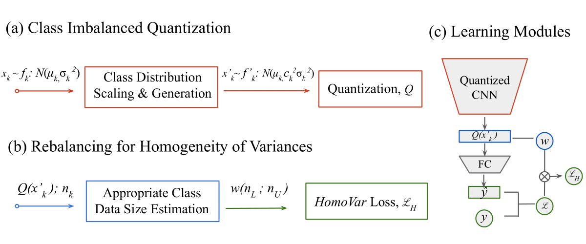

# ClimbQ: Class Imbalanced Quantization Enabling Robustness on Efficient Inferences
NeurIPS 2022 Accepted Paper - Quantization, Efficient Inference, Imbalance Learning (Long-tail)



* **Motivation**: to diminish the quantization error from the heterogeneity of class distributions (variations & sample numbers)

* **Method**: class distribution scaling + rebalance loss for homogeneity of class variances

## Requirements

* python3
* pytorch==1.7.1
* cudatoolkit==11.0.221 
* numpy==1.19.2
* tensorboardx==1.4

## Implementation

* e.g. 4-bit ResNet-20 on CIFAR-10-LT (gamma = 10).

### Data Preparation

* e.g. CIFAR-10.

```shell
cd src/
```
```shell
mkdir data_dir/
```

Save training (testing) image data to the path src/data_dir/cifar10/. (e.g. src/data_dir/cifar10/train/airplane/0001.jpg)

### Data Generation - Imbalance (Long-tail) Data

* e.g. CIFAR-10-LT (gamma = 10).

##### 1. Generate imbalance data

```shell
python3 longTailDataGeneator.py --data_dir "src/data_dir/cifar10/" --output_csv "cifar10.csv" --gamma 10
```

Files 'cifar10_train10.csv' and 'cifar10_test.csv' are shown under src/.

##### 2. Move csv files

```shell
mv -r *.csv resnet-20-cifar-10/data/
```

**ps.** These two steps are neglibible since the csv files have been generated in the specific directories (see the next step).

### Training & Testing

* e.g. 4-bit ResNet-20 on CIFAR-10-LT (gamma = 10).

```shell
cd resnet-20-cifar-10/
```

Generated csv files are located under data/.

##### 1. Pretrain

Pretrain and save models to the path resnet-20-cifar-10/pretrained/.

##### 2. Quantize & Test

```shell
python3 main.py --csv_dir data/ --job_dir "experiment/ours/resnet/t_4bit_pre32bit" --method "ours" --source_dir "pretrained" --source_file "res20_32bit/model_best.pt" --arch resnet --bitW 4 --abitW 4 --target_model "resnet20_quant" --source_model "resnet20" --lt_gamma 10 --num_epochs 50 --train_batch_size 128 --eval_batch_size 100 --lr 0.04
```


## Citation

```shell
@inproceedings{
  chen2022climbq,
  title={ClimbQ: Class Imbalanced Quantization Enabling Robustness on Efficient Inferences},
  author={Ting-An Chen and Ming-syan Chen},
  booktitle={Advances in Neural Information Processing Systems},
  editor={Alice H. Oh and Alekh Agarwal and Danielle Belgrave and Kyunghyun Cho},
  year={2022},
  url={https://openreview.net/forum?id=F7NQzsl334D}
}
```
